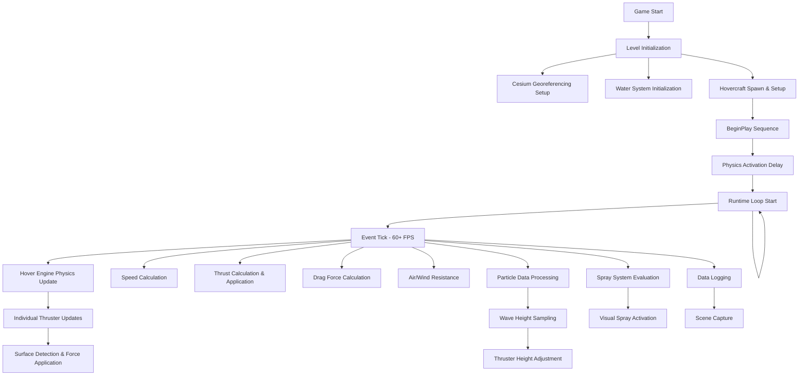

"<Hovercraft_simulator_documentation># Hovercraft Training Simulator: Complete System Documentation

## Executive Summary

This repository contains the source documentation for an advanced hovercraft pilot training simulator built using Unreal Engine. The simulator implements a highly realistic physics-based representation of a 2000TD hovercraft, complete with accurate aerodynamics, hydrodynamics, propulsion systems, and environmental interactions. The system is designed for professional pilot training applications and integrates real-world geographic data, sophisticated particle effects, and comprehensive data logging capabilities.

## System Architecture Overview

### Core Philosophy
The simulator operates on a multi-layered architecture where visual representation is tightly coupled with physical simulation. The system distinguishes itself through:

1. **GPU-Accelerated Wave Simulation**: Real-time Gerstner wave calculations for realistic water surface behavior
2. **Physics-Driven Craft Behavior**: Multiple force calculation systems working in concert to simulate authentic hovercraft dynamics
3. **Data-Driven Training**: Comprehensive logging and monitoring systems for training effectiveness analysis
4. **VR-Ready Implementation**: Multiple camera systems supporting traditional and virtual reality training modes

### High-Level System Components

```
┌─────────────────────────────────────────────────────────────────┐
│                    SIMULATOR ENVIRONMENT                        │
├─────────────────────────────────────────────────────────────────┤
│  Cesium Georeference │  WaterBodyLake │  Landscape Components   │
│  Real-world coords   │  Wave simulation│  Terrain collision     │
└─────────────────────────────────────────────────────────────────┘
                                │
┌─────────────────────────────────────────────────────────────────┐
│                     BP_2000TD_CRAFT                             │
├─────────────────────────────────────────────────────────────────┤
│  Movement Component  │  Thrust System  │  Buoyancy Component   │
│  Physics Engine     │  Air Pressure   │  Water Interaction    │
│  Force Application  │  Thrusters      │  Stability Control   │
└─────────────────────────────────────────────────────────────────┘
                                │
┌─────────────────────────────────────────────────────────────────┐
│                    CONTROL & DATA SYSTEMS                       │
├─────────────────────────────────────────────────────────────────┤
│  Input Mapping      │  Data Logger    │  Camera Systems       │
│  Player Controls    │  Performance    │  VR/Traditional       │
│  Force Feedback     │  Analytics      │  Scene Capture        │
└─────────────────────────────────────────────────────────────────┘
```

## Environmental Systems

### Geographic Integration
The simulator leverages Cesium's georeferencing technology to place the training environment within real-world coordinates. This integration provides:

- **CesiumGeoreference**: Converts between Unreal world coordinates and geographic coordinates (latitude/longitude)
- **Cesium3DTileset**: Streams high-resolution terrain and satellite imagery
- **CesiumSunSky**: Provides realistic lighting based on geographic location and time of day

### Water System Architecture
The water simulation represents one of the most sophisticated aspects of the simulator:

#### Gerstner Wave Implementation
Located in `CategorisingCodeBase/Blueprints/2000TD/GerstnerWave.md`, this system implements mathematically accurate ocean wave behavior:

- **Multi-Wave Superposition**: Combines up to 32 individual wave components
- **Physical Accuracy**: Implements the dispersion relationship v = √(gλ/2π) where wave speed depends on wavelength
- **Real-Time Performance**: GPU-accelerated calculations maintaining 60+ FPS
- **Steepness Control**: Prevents unrealistic wave breaking through threshold management

**Technical Implementation**: Wave parameters (direction, wavelength, amplitude, steepness) are stored in GPU textures, enabling parallel processing of multiple wave calculations. Each wave contributes to both surface displacement (World Position Offset) and surface normal vectors for accurate lighting and physics interactions.

#### WaterBodyLake System
The water bodies provide collision detection and interaction surfaces:
- **Surface Detection**: Line tracing determines craft-to-water contact points
- **Dynamic Height Adjustment**: Hover thrusters automatically adjust to water surface variations
- **Spray Generation**: Water interaction triggers contextual particle effects

## Hovercraft Physics Implementation

### Core Vehicle Structure: BP_2000TD_Craft

The main hovercraft blueprint represents a complex multi-component system modeling a real 2000TD hovercraft. The implementation is divided into several specialized subsystems:

#### Physics Initialization (`BeginPlay.md`)
The craft initialization sequence is carefully orchestrated:

1. **Mass and Center of Mass Configuration**: Sets realistic weight distribution using `AllUpWeight` parameter
2. **Buoyancy System Activation**: Configures pontoon locations and buoyancy damping coefficients
3. **Air Thruster Network Setup**: Initializes multiple air pressure thrusters positioned around the craft perimeter
4. **Particle System Integration**: Spawns Niagara systems for each water body, linking visual effects to physics calculations
5. **Data Logging Initialization**: Establishes telemetry collection for training analysis
6. **Controlled Physics Activation**: Uses Timeline_7 to manage the sequence of physics system activation, preventing simulation instabilities

#### Runtime Physics Loop (`EventTick.md`)

The main simulation loop executes multiple physics calculations each frame:

**Sequence 1: Hover Engine Physics Update**
- Calls `HoverEngineController.PhysicsUpdate` to manage individual thruster behaviors
- Updates hover location data for Niagara particle systems
- Maintains real-time feedback between physics and visual effects

**Sequence 2: Buoyancy and Orientation Calculation**
- Determines which pontoons are submerged in water
- Updates the orientation component with submersed point data
- Calculates stability and roll/pitch corrections based on water contact

**Sequence 3: Drag Force Application**
The system implements comprehensive drag modeling:
```
TotalDrag = RWM + RSWM + RSR + RM + RSW
```
Where:
- RWM: Resistance from Water on Maneuvering
- RSWM: Resistance from Shallow Water on Maneuvering  
- RSR: Resistance from Spray and Rivulet
- RM: Resistance from Momentum
- RSW: Resistance from Shallow Water

**Sequence 4: Aerodynamic Force Calculations**
- **Air Resistance**: Calculates force opposing craft movement through air
- **Wind Resistance**: Applies environmental wind effects with proper force application points
- Both systems use angle calculation utilities to determine craft orientation relative to airflow

#### Individual Thruster Physics (`CalculateAirPressureForce.md`)

Each air pressure thruster operates as an independent physics component:

**Surface Detection Process**:
1. Performs line trace from thruster position downward
2. Determines surface type (water vs. ground)
3. Applies different force parameters based on surface:
   - Water: Reduced desired height (-5.0 units) for surface penetration compensation
   - Ground: Standard height parameters

**Force Calculation**:
- Spring-damper system with configurable stiffness (3389.23) and damping (116.87)
- RPM threshold enforcement (minimum 700 RPM for force application)
- Location-specific force application for realistic handling characteristics

### Propulsion Systems

#### Main Thrust Component (`Thrust.md`)
The propulsion system implements a sophisticated thrust calculation model:

**Coefficient Calculation Process**:
1. **RPM Input Processing**: Clamps minimum RPM to 1200 for realistic engine behavior
2. **Power Curve Calculation**: Derives power coefficients based on propeller specifications
3. **Thrust Coefficient Derivation**: Calculates CT0-CT6 coefficients for various operating conditions
4. **Velocity Interpolation**: Creates thrust-velocity relationships through cubic polynomial fitting

**Thrust Calculation Methods**:
- **Basic Thrust**: `AY + BY*X + CY*X² + DY*X³` where X is craft speed
- **Pitch-Adjusted Thrust**: Incorporates propeller pitch angle effects
- **Force Vector Generation**: Converts scalar thrust to directional force vectors

#### Movement Component Integration (`CalculateAndApplyThrust.md`)

The movement component orchestrates thrust application:

1. **Speed and Angle Integration**: Combines craft speed with propeller pitch angle
2. **Rudder Control Logic**: Applies steering rotation only when pitch angle is positive
3. **Force Scaling**: Converts thrust to Unreal Engine units (centiNewtons) and applies RPM scaling
4. **Precise Force Application**: Applies thrust at propeller shaft location for accurate moment generation

### Advanced Physics Features

#### Particle-to-Physics Feedback (`ReceiveParticleData.md`)
This system creates a critical bridge between GPU-rendered wave effects and CPU physics calculations:

1. **Wave Height Sampling**: Particles positioned at thruster locations sample GPU-calculated wave heights
2. **Coordinate Transformation**: Converts particle data from GPU coordinate space to hovercraft local coordinates
3. **Real-Time Height Adjustment**: Feeds wave height data back to individual thruster components
4. **Dynamic Response**: Enables craft to respond realistically to wave patterns and water surface irregularities

This feedback mechanism ensures that visual wave representations directly influence craft behavior, providing authentic training scenarios where pilots must respond to varying sea states.

#### Spray Dynamics System (`SprayDynamics.md`)
The spray system provides both visual feedback and realistic training scenarios:

**Speed-Based Activation**:
- **Hump Speed Range** (4.5-13 knots): All spray systems activate during this critical speed range where hovercraft experience characteristic performance challenges
- **Movement-Based Activation**: Individual spray systems activate based on roll/pitch angles (>1 degree threshold)

**Directional Spray Logic**:
- Forward spray: Active during forward pitch (nose down)
- Aft spray: Active during aft pitch (nose up)  
- Port/Starboard sprays: Active during corresponding roll movements

This system helps pilots understand craft behavior during different operational phases and provides visual cues for proper handling technique.

### Angle Calculation Utilities (`AngleCalculation.md`)

The angle calculation system provides essential utilities for aerodynamic and hydrodynamic calculations:

**Functionality**:
- Converts velocity vectors to azimuth and elevation angles relative to craft orientation
- Validates input vector orthogonality and normalization
- Supports both air resistance and wind resistance calculations
- Provides robust error handling for edge cases (zero velocity, non-orthogonal vectors)

**Applications**:
- Air resistance force calculation based on craft attitude relative to velocity
- Wind resistance calculation based on craft attitude relative to wind direction
- Surface area lookup for drag coefficient determination

## Control Systems

### Input Mapping Architecture (`controller.md`)
The control system implements a comprehensive input mapping context (`IMC_Hovercraft`) supporting multiple control paradigms:

**Engine Control Actions**:
- Engine on/off toggle
- RPM lever control (analog input)
- Discrete RPM increase/decrease
- Engine RPM simulation mode

**Steering Control Actions**:
- Left/right steering discrete inputs
- Analog steering wheel input
- Reverse steering mode toggle

**Propulsion & Flight Actions**:
- Propeller pitch lever control
- Elevator control for pitch attitude
- Fuel ballast management

**Camera Control Actions**:
- Multi-camera switching (1st person, 3rd person, VR)
- Camera zoom controls
- Free-look camera movement

### Movement Component Event Architecture (`EventGraph.md`)

The movement component operates through a clean event-driven architecture:

**Initialization Phase**:
- Validates owner casting to `BP_2000TDCraft`
- Establishes player controller reference
- Sets up component relationships

**Runtime Phase**:
- **Speed Calculation**: Continuous monitoring of craft velocity with unit conversions (cm/s to ft/s and knots)
- **Thrust Application**: Per-frame thrust calculation and force application
- Maintains consistent 60+ FPS performance through optimized calculation sequences

## Data Systems and Training Analytics

### Comprehensive Data Logging
The simulator implements extensive data collection for training analysis:

**IMU Simulation**: Multiple `IMUSpoofingSceneComponent` instances simulate realistic inertial measurement data
**Performance Metrics**: Real-time tracking of speed, attitude, control inputs, and system responses
**Scene Capture**: Automated screenshot capture at 20Hz intervals for training review
**Telemetry Export**: Structured data logging with timestamp correlation for post-training analysis

### Experimental Framework
The `ExperimentManagerComponent` provides:
- Controlled test scenario execution
- Standardized performance measurement protocols
- Repeatable training sequence management
- Statistical analysis data collection

## Technical Performance Considerations

### Real-Time Performance Optimization
The simulator maintains strict performance requirements:

**Frame Rate Target**: 60+ FPS for responsive control feel
**Physics Timestep**: Consistent physics calculations independent of frame rate
**GPU Utilization**: Efficient wave calculation and particle systems
**Memory Management**: Optimized component lifecycle and garbage collection

### VR Compatibility
The system supports virtual reality training through:
- **Dedicated VR Camera**: Properly configured for head-mounted displays
- **Performance Optimization**: Maintained frame rates for VR comfort
- **Control Adaptation**: VR-specific input handling and interaction methods

## System Integration and Data Flow

### Complete Simulation Loop



### Component Interconnection Matrix

The following table shows the critical data dependencies between major system components:

| Component | Provides Data To | Receives Data From | Update Frequency |
|-----------|------------------|-------------------|------------------|
| EventTick | All Physics Systems | User Input, System State | 60+ Hz |
| HoverEngineController | Individual Thrusters | EventTick, Movement Component | 60+ Hz |
| ThrustComponent | Movement Component | RPM Input, Pitch Settings | On Parameter Change |
| ReceiveParticleData | Air Thrusters | Niagara Wave System | Per Particle Update |
| SprayDynamics | Particle Systems | Movement Component | Event-Driven |
| GerstnerWave | Visual Rendering | Time, World Position | 60+ Hz |
| DataLogger | File System | All Components | 20 Hz |

## Training Applications and Educational Value

### Pilot Training Scenarios
The simulator addresses specific hovercraft pilot training requirements:

**Critical Speed Management**: The ""hump speed"" range (4.5-13 knots) where hovercraft experience unique handling characteristics is accurately modeled, allowing pilots to practice this challenging operational phase.

**Surface Transition Training**: Realistic water-to-land and land-to-water transitions with appropriate surface detection and force modeling changes.

**Weather Condition Simulation**: Variable wind conditions and wave states for training in diverse environmental conditions.

**Emergency Procedures**: System monitoring and response training through comprehensive data logging and performance analysis.

### Skill Transfer Effectiveness
The simulator's high-fidelity physics modeling ensures that skills developed in the virtual environment transfer effectively to real-world operations:

- **Accurate Force Feedback**: Realistic control response and craft behavior
- **Environmental Authenticity**: Real-world geographic integration and weather modeling
- **Performance Analytics**: Detailed metrics for progress tracking and skill assessment

## Technical Innovation and Research Contributions

### Advanced Wave-Physics Integration
The GPU-to-CPU wave height transfer system represents a novel approach to real-time water simulation integration, enabling:
- Real-time wave height sampling at multiple craft locations
- Dynamic thruster response to surface conditions
- Minimal performance overhead through optimized data transfer

### Multi-Modal Training Platform
The system's support for traditional display, VR, and data analysis modes provides a comprehensive training platform suitable for different learning preferences and institutional requirements.

### Open Architecture Design
The component-based architecture allows for:
- Easy modification of physics parameters for different hovercraft types
- Integration of additional sensors and measurement systems
- Expansion to multi-craft training scenarios

## Future Development Pathways

### System Extensibility
The current architecture supports several potential enhancements:

**Multi-Vehicle Simulation**: The component-based design allows for multiple craft instances with independent physics calculations.

**Advanced Weather Systems**: Integration of dynamic weather patterns, seasonal variations, and extreme condition modeling.

**Collaborative Training**: Network architecture for multi-pilot training scenarios and instructor oversight capabilities.

**AI-Assisted Training**: Integration of artificial intelligence for adaptive difficulty adjustment and personalized training progression.

### Research Applications
The simulator's comprehensive data collection and realistic physics modeling make it suitable for:

**Hovercraft Design Research**: Testing new configurations and control systems in virtual environments
**Human Factors Studies**: Analysis of pilot behavior and decision-making under various conditions
**Training Methodology Research**: Evaluation of different pedagogical approaches to hovercraft pilot education

## Conclusion

This hovercraft training simulator represents a sophisticated integration of modern game engine technology, advanced physics simulation, and educational methodology. The system successfully bridges the gap between theoretical understanding and practical skill development by providing an authentic, measurable, and engaging training environment.

The technical implementation demonstrates best practices in real-time simulation development, with particular strengths in:

- **Physics Accuracy**: Comprehensive force modeling covering all aspects of hovercraft operation
- **Performance Optimization**: Maintained real-time performance despite complex calculations
- **Educational Effectiveness**: Data-driven approach to skill development and assessment
- **Technical Innovation**: Novel solutions to GPU-CPU integration challenges

The simulator stands as a testament to the potential of advanced simulation technology in specialized training applications, providing a foundation for continued development in this critical area of maritime and aerospace education.

---

*This documentation represents a comprehensive analysis of the hovercraft training simulator codebase as of the current repository state. The system continues to evolve as new training requirements and technical capabilities are identified.* </Hovercraft_simulator_documentation>"